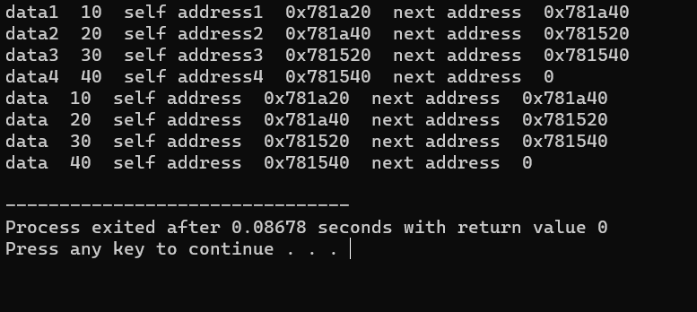
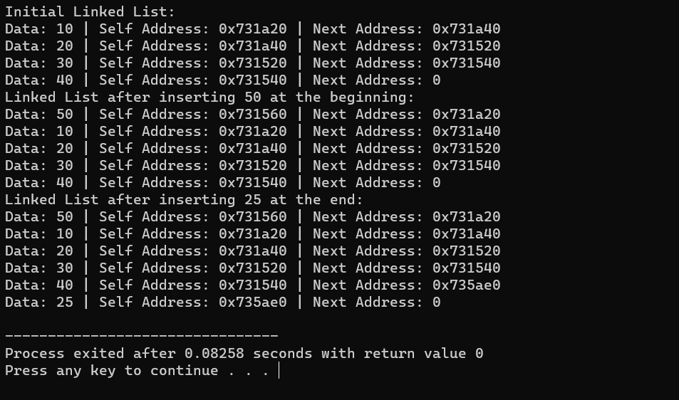
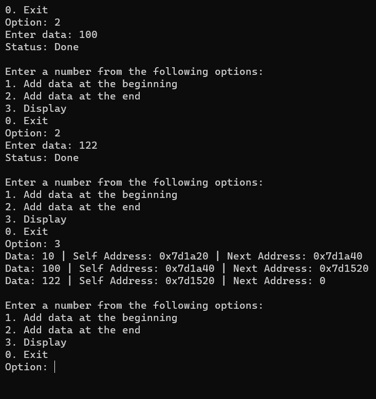

# singly-linked-list

1] [Singly list basic](list.cpp)
This C++ program creates a simple linked list using a Node class and demonstrates the basics of working with linked lists. It creates a linked list of four nodes, displays information about each node, and then traverses and prints the entire linked list. This is a fundamental example of linked list implementation in C++.

  

 

2] [List Addition](addinlist.cpp)
This C++ program demonstrates the implementation of a singly linked list with basic operations, including inserting elements at the beginning and end of the list. It also displays the linked list at different stages, providing a clear example of how linked lists work in C++.

  

 

3] [List with menu](menuwithlist.cpp)

  

 
